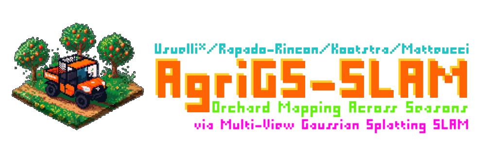

# 🚜 AgriGS-SLAM: Orchard Mapping Across Seasons via Multi-View Gaussian Splatting SLAM



> [!WARNING]
> The manuscript is currently under submission and revision. The source code will be released once the manuscript is accepted for publication, and the dataset release will follow the publication.

> [!CAUTION]
> Temporary Citation (Preprint) - ArXiv: http://arxiv.org/abs/2510.26358
>
> ```bibtex
> @article{usuelli2025agrigsslam,
>   ... TODO
> }
> ```

## 🍎 Overview

AgriGS-SLAM is a Visual–LiDAR SLAM framework designed for robust real-time 3D mapping and reconstruction in agricultural orchards. The system couples direct LiDAR odometry and loop closures with multi-camera 3D Gaussian Splatting (3DGS) rendering to handle the unique challenges of orchard environments, including repetitive row geometry, seasonal appearance changes, and wind-driven foliage motion.

## 🌳 Abstract

Autonomous robots in orchards require real-time
3D scene understanding despite repetitive row geometry, seasonal appearance changes, and wind-driven foliage motion. We present AgriGS-SLAM, a Visual–LiDAR SLAM framework that couples direct LiDAR odometry and loop closures with multi-camera 3D Gaussian Splatting (3DGS) rendering. Batch rasterization across complementary viewpoints recovers orchard structure under occlusions, while a unified gradientdriven map lifecycle executed between keyframes preserves fine details and bounds memory. Pose refinement is guided by a probabilistic LiDAR-based depth consistency term, backpropagated through the camera projection to tighten geometryappearance coupling. We deploy the system on a field platform in apple and pear orchards across dormancy, flowering, and harvesting, using a standardized trajectory protocol that evaluates both training-view and novel-view synthesis to reduce 3DGS overfitting in evaluation. Across seasons and sites, AgriGS-SLAM delivers sharper, more stable reconstructions and steadier trajectories than recent state-of-the-art 3DGS-SLAM baselines while maintaining real-time performance ontractor. While demonstrated in orchard monitoring, the approach can be applied to other outdoor domains requiring
robust multimodal perception.

## 👨‍🌾 Authors

- **Mirko Usuelli**¹* and **Matteo Matteucci**¹  
  Dipartimento di Bioingegneria, Elettronica e Informazione, Politecnico di Milano, 20133 Milano, Italy  
  {mirko.usuelli, matteo.matteucci}@polimi.it

- **David Rapado-Rincon**² and **Gert Kootstra**²  
  Agricultural Biosystems Engineering, Wageningen University & Research, 6708 PB Wageningen, The Netherlands  
  {david.rapadorincon, gert.kootstra}@wur.nl

*Corresponding author

## 🙏 Acknowledgments

The authors thank the Fruit Research Center (FRC) in Randwijk for access to the orchards. Mirko Usuelli's work was carried out within the Agritech National  Research Center and funded by the EU Next-GenerationEU (PNRR – M4C2, Inv. 1.4 – D.D. 1032 17/06/2022, CN00000022). This manuscript reflects only the authors' views; the EU and Commission are not responsible. Contributions from Matteo Matteucci, Gert Kootstra, and David Rapado-Rincon were co-funded by the EU Digital Europe Programme (AgrifoodTEF, GA Nº 101100622).

## 📝 License

    ```
    TBD

---

<h5 align="center">

<p style="text-align: center;">
    <a href="https://airlab.deib.polimi.it/">
         airlab.deib.polimi.it
    </a> &nbsp;&middot;&nbsp;
    <a href="https://github.com/AIRLab-POLIMI">
         AIRLab@POLIMI
    </a> &nbsp;&middot;&nbsp;
    <a href="https://www.linkedin.com/company/airlab-polimi/">
         AIRLab POLIMI
    </a> &nbsp;&middot;&nbsp;
    <a href="https://www.instagram.com/airlab_polimi/">
         @airlab_polimi
    </a>
</p>

<div style="text-align: center; background-color: white;">
    
</div>

</h5>
