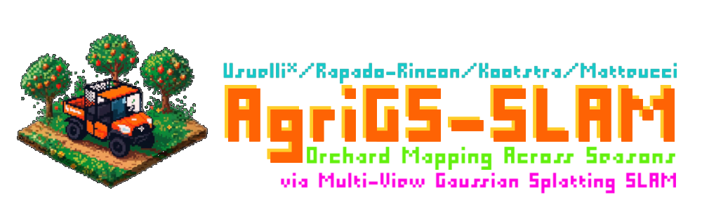
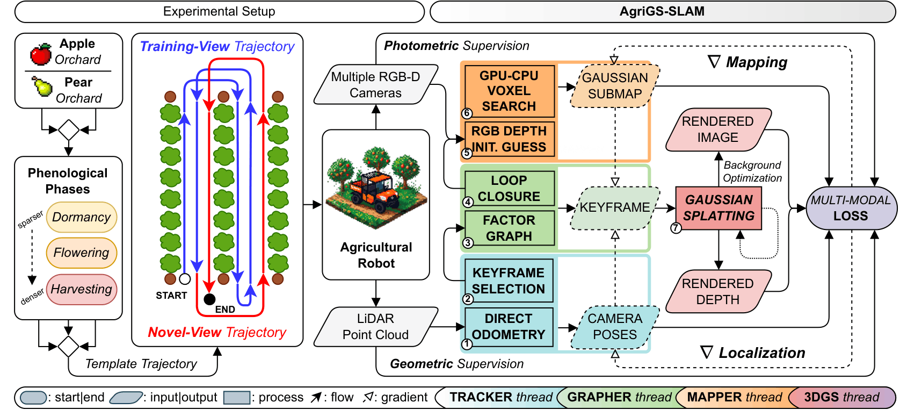

# 🚜 AgriGS-SLAM: Orchard Mapping Across Seasons via Multi-View Gaussian Splatting SLAM [RA-L 2026]



<p align="center">
  <a href="https://mirkousuelli.github.io/agri-gs-slam/">
    
  </a>
  <a href="https://doi.org/10.1109/LRA.2026.3685453">
    
  </a>
  <a href="https://arxiv.org/abs/2510.26358">
    
  </a>
  <a href="https://huggingface.co/datasets/foxmirko/agri-gs-slam-dataset-demo">
    
  </a>
  <a href="https://hub.docker.com/r/mirkousuelli/agri-gs-slam">
    
  </a>
</p>

> [!NOTE]
> **Accepted at IEEE Robotics and Automation Letters (RA-L), 2026.**
> The **full multi-season AgriGS-SLAM dataset** (apple + pear orchards across dormancy, flowering, and harvesting) will be publicly released in collaboration with [**AgrifoodTEF**](https://agrifoodtef.eu) (EU Digital Europe Programme, GA Nº 101100622) — *coming soon*. In the meantime, you can try the pipeline on the [**demo dataset on Hugging Face**](https://huggingface.co/datasets/foxmirko/agri-gs-slam-dataset-demo), which is fetched automatically by the setup wizard.

## 🍎 Overview



**AgriGS-SLAM** is a unified Visual–LiDAR SLAM framework that couples direct LiDAR odometry and loop closures with multi-camera 3D Gaussian Splatting (3DGS) rendering. A batch rasterization strategy over three synchronized RGB-D cameras recovers orchard structure even under heavy occlusions and limited lateral viewpoints, while a gradient-driven map lifecycle — executed asynchronously between keyframes — preserves geometric detail and keeps GPU memory bounded throughout long field traversals. Pose refinement is driven by a probabilistic KL depth-consistency term derived from LiDAR measurements, back-propagated through differentiable camera projection to tighten the geometry–appearance coupling.

The system is validated on a tractor-mounted platform in apple and pear orchards across three phenological stages — dormancy, flowering, and harvesting — using a standardized trajectory protocol that evaluates both training-view reconstruction and novel-view synthesis. Across all seasons and orchards, AgriGS-SLAM consistently outperforms Photo-SLAM, Splat-SLAM, PINGS, and OpenGS-SLAM in rendering fidelity and trajectory accuracy, while operating in real time on-tractor.

For full results, qualitative comparisons, and dataset previews, visit the **[project page](https://mirkousuelli.github.io/agri-gs-slam/)**.

## 📁 Repository layout

- [src/odometry/](src/odometry/) — C++ LiDAR odometry module (pybind11 bindings)
- [src/scancontext/](src/scancontext/) — C++ Scan Context loop-closure module (pybind11 bindings)
- [src/pipeline.py](src/pipeline.py) — Python entry point for the full pipeline
- [config/default.yaml](config/default.yaml) — default configuration
- [docker/](docker/) — `Dockerfile` and `docker-compose.yml`
- [scripts/setup.sh](scripts/setup.sh) — one-shot setup wizard (recommended)

## 🔧 Prerequisites (host)

- NVIDIA GPU
- Docker + Docker Compose plugin
- [NVIDIA Container Toolkit](https://docs.nvidia.com/datacenter/cloud-native/container-toolkit/latest/install-guide.html)
- (Optional) X11 running, for the viewer. Allow container access once per session:
  ```bash
  xhost +local:docker
  ```

## 🚀 Quick start

From the repo root:

```bash
./scripts/setup.sh
```

The wizard performs every step required to go from a clean checkout to a ready-to-run environment:

1. Checks host prerequisites (Docker, Compose, NVIDIA runtime)
2. Creates host-side `data/` and `results/` (mounted into the container at `/agri_gs_slam/data` and `/agri_gs_slam/results`)
3. Builds the Docker image (`mirkousuelli/agri-gs-slam:stable`)
4. Starts `agri-gs-slam-container` with the repo mounted at `/agri_gs_slam`
5. Compiles `src/odometry` and `src/scancontext` **in Release mode** inside the container, each into its own `build/` folder
6. Downloads the [`foxmirko/agri-gs-slam-dataset-demo`](https://huggingface.co/datasets/foxmirko/agri-gs-slam-dataset-demo) dataset from Hugging Face into `data/agri-gs-slam-dataset-demo/` (skipped if already present). `config/default.yaml → dataloader.path` already points there.
7. Extracts any PLY archives shipped with the demo dataset and verifies them
8. Drops you into an interactive shell inside the container

Flags:

| flag           | effect                                              |
| -------------- | --------------------------------------------------- |
| `--rebuild`    | force `docker compose build --no-cache`             |
| `--clean-cpp`  | wipe `src/*/build` before recompiling               |
| `--no-shell`   | skip the final interactive shell                    |
| `-h`, `--help` | show usage                                          |

Override host-side mount paths by exporting `DATA_DIR=/abs/path` or `RESULTS_DIR=/abs/path` before running the wizard.

Once the wizard finishes you are inside the container — just run the pipeline:

```bash
cd /agri_gs_slam/src
python3 pipeline.py --gs-slam
```

## ▶️ Running the pipeline

Pick exactly one modality:

- `--odom` — LiDAR odometry only (no loop closure)
- `--slam` — full SLAM with loop closure
- `--gs-odom` — odometry + Gaussian Splatting mapping
- `--gs-slam` — full SLAM + Gaussian Splatting *(default if no flag is given)*

Add `--gs-viewer` together with `--gs-odom` / `--gs-slam` to enable the live viewer. The container exposes ports **8080** (viewer) and **8500** (dashboard).

Configuration is loaded from [config/default.yaml](config/default.yaml); edit it to point at your dataset and tune SLAM / splatting parameters.

## 🔁 Re-entering / stopping

Open another shell into the running container:

```bash
docker compose -f docker/docker-compose.yml exec agri-gs-slam bash
```

Stop the container:

```bash
docker compose -f docker/docker-compose.yml down
```

## 🛠️ Manual workflow (if you prefer not to use the wizard)

```bash
# 1. Build and start
cd docker
docker compose build
docker compose up -d
docker compose exec agri-gs-slam bash

# 2. Compile the C++ modules (Release) — inside the container
for mod in odometry scancontext; do
    cd /agri_gs_slam/src/$mod
    mkdir -p build && cd build
    cmake -DCMAKE_BUILD_TYPE=Release ..
    cmake --build . -j"$(nproc)"
done

# 3. Run the pipeline
cd /agri_gs_slam/src
python3 pipeline.py --gs-slam
```

## 📚 Citation

If you use AgriGS-SLAM in your research, please cite:

```bibtex
@article{usuelli2026agrigs,
  author={Usuelli, Mirko and Rapado-Rincon, David and Kootstra, Gert and Matteucci, Matteo},
  journal={IEEE Robotics and Automation Letters},
  title={AgriGS-SLAM: Orchard Mapping Across Seasons via Multi-View Gaussian Splatting SLAM},
  year={2026},
  volume={11},
  number={6},
  pages={7102-7109},
  doi={10.1109/LRA.2026.3685453}
}
```

## 👨‍🌾 Authors

- **Mirko Usuelli**¹* and **Matteo Matteucci**¹
  Dipartimento di Bioingegneria, Elettronica e Informazione, Politecnico di Milano, 20133 Milano, Italy
  {mirko.usuelli, matteo.matteucci}@polimi.it

- **David Rapado-Rincon**² and **Gert Kootstra**²
  Agricultural Biosystems Engineering, Wageningen University & Research, 6708 PB Wageningen, The Netherlands
  {david.rapadorincon, gert.kootstra}@wur.nl

*Corresponding author

## 🙏 Acknowledgments

The authors thank the **Fruit Research Center (FRC) in Randwijk** for access to the orchards. Mirko Usuelli's work was carried out within the **Agritech National Research Center** and funded by the European Union — **Next-GenerationEU** (PNRR – M4C2, Inv. 1.4 – D.D. 1032 17/06/2022, CN00000022). This manuscript reflects only the authors' views; the EU and Commission are not responsible. Contributions from Matteo Matteucci, Gert Kootstra, and David Rapado-Rincon were co-funded by the European Union — **Digital Europe Programme** ([AgrifoodTEF](https://agrifoodtef.eu), GA Nº 101100622).

<p align="center">
  <a href="https://agritechcenter.it" target="_blank" title="Agritech National Research Center">
    
  </a>
  &nbsp;&nbsp;&nbsp;
  <a href="https://next-generation-eu.europa.eu" target="_blank" title="Next Generation EU">
    
  </a>
  &nbsp;&nbsp;&nbsp;
  <a href="https://agrifoodtef.eu" target="_blank" title="AgrifoodTEF">
    
  </a>
  &nbsp;&nbsp;&nbsp;
  <a href="https://www.polimi.it" target="_blank" title="Politecnico di Milano">
    
  </a>
  &nbsp;&nbsp;&nbsp;
  <a href="https://www.wur.nl" target="_blank" title="Wageningen University &amp; Research">
    
  </a>
</p>

## 📝 License

This project is released under the **[Apache License 2.0](LICENSE)** — a permissive license well-suited to academic and industrial research use, with an explicit patent grant and attribution requirements.

> [!WARNING]
> **Research code — not production-ready.** AgriGS-SLAM is intended for **research and academic experimentation**. While it has been validated on our tractor-mounted platform across multiple orchards and seasons, it may contain **untested edge cases, hardware-specific assumptions, and limitations** that have not been characterized for safety-critical or real-world deployment scenarios. Use at your own risk; the authors provide no warranty regarding fitness for any particular purpose. See the [LICENSE](LICENSE) file for the full disclaimer.

---

<h5 align="center">

<p style="text-align: center;">
    <a href="https://airlab.deib.polimi.it/">
         airlab.deib.polimi.it
    </a> &nbsp;&middot;&nbsp;
    <a href="https://github.com/AIRLab-POLIMI">
         AIRLab@POLIMI
    </a> &nbsp;&middot;&nbsp;
    <a href="https://www.linkedin.com/company/airlab-polimi/">
         AIRLab POLIMI
    </a> &nbsp;&middot;&nbsp;
    <a href="https://www.instagram.com/airlab_polimi/">
         @airlab_polimi
    </a>
</p>

<div style="text-align: center; background-color: white;">
    
</div>

</h5>
